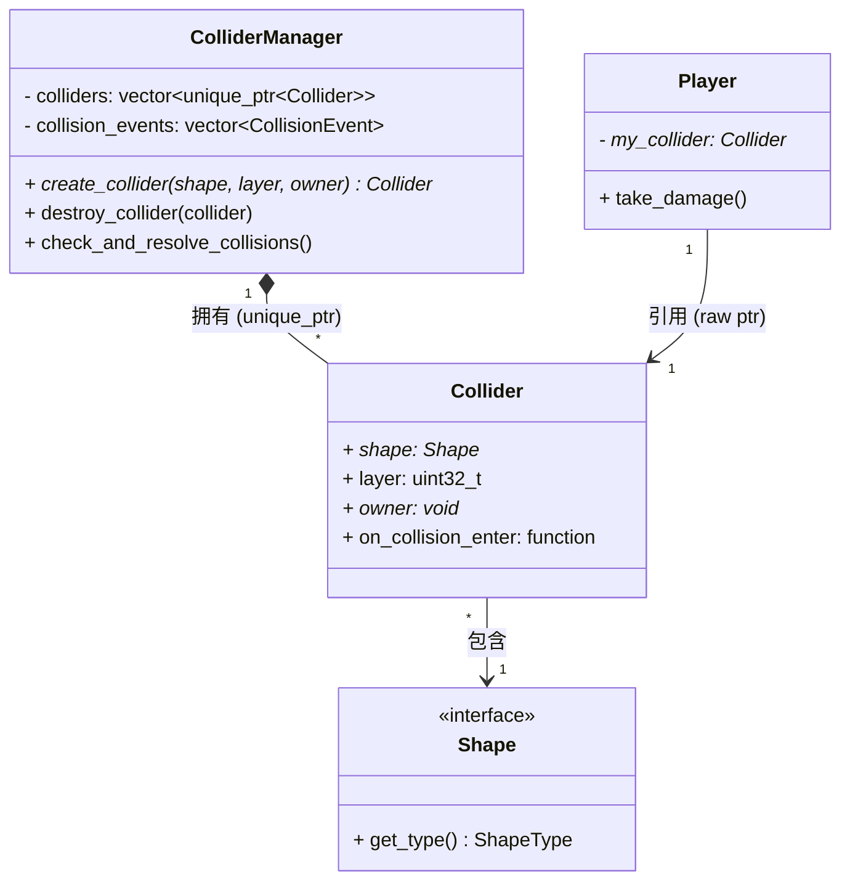

# 2
```markdown
```mermaid
sequenceDiagram
    participant Loop as 游戏主循环 (Game Loop)
    participant Manager as ColliderManager
    participant ColA as Collider (玩家)
    participant ColB as Collider (敌人)
    participant Player as Player实体

    Loop->>Manager: 1. check_and_resolve_collisions()
    
    rect rgb(240, 248, 255)
    Note over Manager: 阶段一：纯检测（收集事件，绝不修改状态）
    Manager->>Manager: 清空上一帧的 collision_events
    Manager->>Manager: 双重循环遍历所有 Collider
    Manager->>Manager: 发现 ColA 和 ColB 形状重叠
    Manager->>Manager: 将 {ColA, ColB} 压入事件队列 (push_back)
    end

    rect rgb(240, 255, 240)
    Note over Manager, Player: 阶段二：统一执行（安全触发回调）
    Manager->>ColA: 遍历队列：执行 ColA.on_collision_enter(ColB)
    ColA->>Player: 触发绑定的 Lambda: take_damage()
    Manager->>ColB: 遍历队列：执行 ColB.on_collision_enter(ColA)
    end
```

